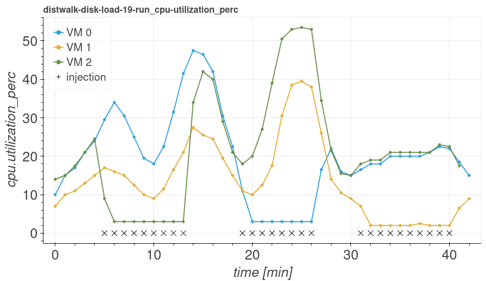
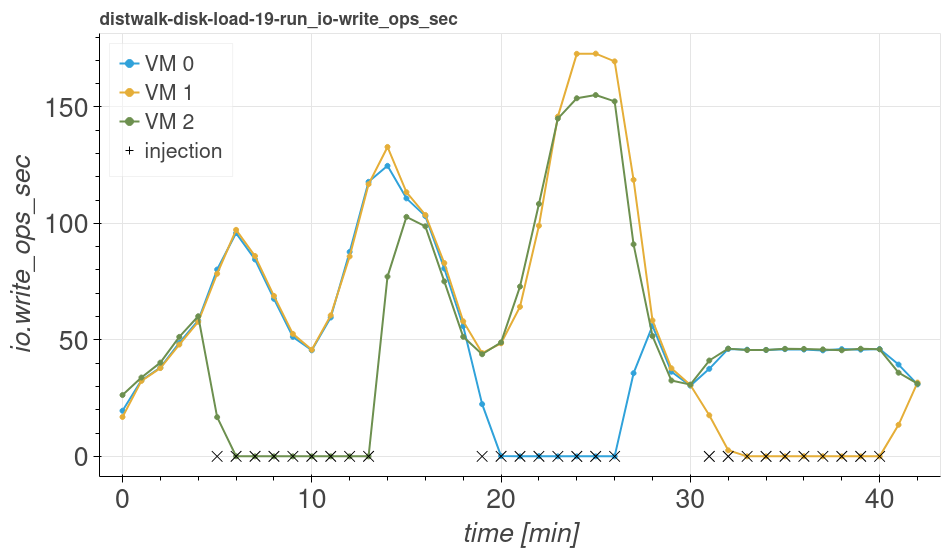
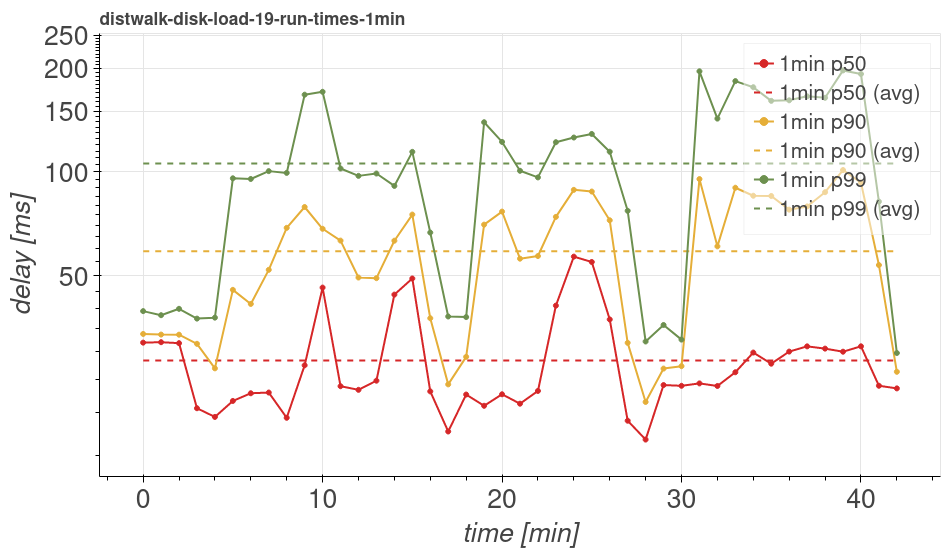

[](https://github.com/giacomolanciano/intelligent-cloud-operations/blob/master/LICENSE)
[](https://zenodo.org/badge/latestdoi/485707047)

# Intelligent Cloud Operations

This repo contains the companion material of the paper

**A 2-phase Strategy For Intelligent Cloud Operations**<br>
[Giacomo Lanciano](mailto:giacomo.lanciano@sns.it)\*, Remo Andreoli, Tommaso Cucinotta, Davide Bacciu, Andrea Passarella<br>
*Under review*<br>

\* *contact author*

## Requirements

In what follows, we provide instructions to install the required dependencies, assuming a setup that is similar to our
testing environment. The test-bed used for our experiments was composed by:

1. A Dell R630, equipped with: 2 Intel Xeon E5-2640 v4 CPUs (20 hyper-threads each) running at 2.40 GHz; 64 GB of RAM; a
   3.3 TB Dell PERC H330 Mini hard disk; Ubuntu `22.04 LTS`; Linux kernel `5.15.0`. This host was used as *controller*
   and *compute* node.

2. A Dell R740xd, equipped with: 2 Intel Xeon Gold 6238R CPUs (56 hyper-threads each) running at 2.20 GHz; 126 GB of
   RAM; a 2.2 TB Dell PERC H740P Mini hard disk; Ubuntu `20.04 LTS`; Linux kernel `5.4.0`. This host was used as
   *compute* node.

3. A workstation, equipped with: an Intel Core i7-4790K quad-core CPU (8 hyper-threads) running at 4.00 GHz; 16GB of
   RAM; a 500 GB Samsung 850 SSD; Ubuntu `22.04 LTS`; Linux kernel `5.15.0`. This host was used as *compute* node.

### Data

[](https://doi.org/10.5281/zenodo.6509677)

The data used for this work are publicly available. We recommend using our utility to automatically download, decompress
and place such data in the location expected by our tools. To do that, make sure the required dependencies are installed
by running

```bash
apt-get install pbzip2 tar wget
```

To start the download utility, run `make data` from the root of this repo. Once the download terminates, the following
files are placed in `data/`:

| File                                       | Description                                               |
| :----------------------------------------- | :-------------------------------------------------------- |
| `amphora-x64-haproxy.qcow2`                | Image used to create Octavia amphorae                     |
| `distwalk-disk-load-<INCREMENTAL-ID>/`     | `distwalk` runs data                                      |
| `FINAL-rl3-*/`                             | Cassandra runs data                                       |
| `model_dumps/`                             | Dumps of the models used for the validation               |
| `test_load_disk_01-2tpi.dat`               | `distwalk` load trace used to generate the workload       |
| `ubuntu-20.04-server-distwalk-683d9e7.img` | Image used to create Nova instances for the scaling group |

### Python

Python `3.10` must be installed in order to install OpenStack (with Kolla) and run the Python code included in this
repo.

If needed, consider using a tool like [`pyenv`](https://github.com/pyenv/pyenv) to easily install and manage multiple
Python versions on the same system.

### OpenStack

OpenStack `yoga` version is required to run our predictive auto-scaling strategy. On top of the other core OpenStack
services, we leverage on the following:

- Cinder
- Heat
- Manila
- Monasca
- Nova
- Octavia

Follow the [OpenStack documentation](https://docs.openstack.org/yoga/install/) to install the required services.

Alternatively, this repo includes (in `openstack/`) the config files we used to set up an all-in-one OpenStack
containerized deployment using [Kolla](https://docs.openstack.org/kolla/yoga/) (`yoga` version). Follow the
[`kolla-ansible` documentation](https://docs.openstack.org//kolla-ansible/yoga/doc-kolla-ansible.pdf) to decide on
how to fill the fields marked as `TO BE FILLED` in the such files. Then, assuming the following command to be issued
from the `openstack/` directory (unless otherwise specified), deploy OpenStack by applying these steps:

1. If a local Docker registry is not already available, setup one by running `./create-docker-registry.sh`.

   **NOTE**: In this case, [Docker](https://docs.docker.com/engine/install/ubuntu/) must be already installed on the
   node where the registry is being deployed.

2. Install Kolla dependencies by running `./install-deps.sh`.

3. Bootstrap all the involved nodes with the required dependencies by running `./kolla-bootstrap.sh`.

4. Create Octavia certificates by running `kolla-ansible octavia-certificates`.

5. On all nodes, enable block storage capabilities by running `./setup-loopdevice.sh`.

6. Perform the preliminary checks by running `./kolla-prechecks.sh`.

   **NOTE**: If something fails here, the deploy will likely fail as well.

7. Build the required Kolla images by running `./kolla-build-images.sh`.

8. Start the deployment process by running `./kolla-start-all-nodes.sh`.

Once the deployment is up and running, complete the configuration by applying these steps:

1. Create an SSH key-pair to be used for accessing the instances in the scaling group:

   ```bash
   ssh-keygen -t rsa -b 4096
   ```

2. Initialize the current OpenStack project by deploying the resources defined in the `openstack/heat/init.yaml` Heat
   Orchestration Template (HOT):

   ```bash
   openstack stack create --enable-rollback --wait \
       --parameter admin_public_key="<PUBLIC-SSH-KEY-TEXT>" \
       -t heat/init.yaml init
   ```

   **NOTE:** the other parameters concerning networking configs are provided with default values that makes sense on our
   test-bed. Consider reviewing them before deploying.

3. Upload the image to be used for creating LB instances by running `./register-amphora-image.sh`.

4. As it is the case for our test-bed, Octavia may get stuck at creating amphorae due to the provider network subnet
   being different from the host network. When experiencing similar issues, try and apply our workaround by running
   `./octavia-setup.sh`.

### distwalk

We use [`distwalk`](https://github.com/tomcucinotta/distwalk) to generate traffic on the scaling group. To install the
specific version used for our experiments (i.e., commit `683d9e7`), run

```bash
git clone https://github.com/tomcucinotta/distwalk
cd distwalk
git checkout 683d9e7
make
```

The binaries for the client and server modules (`client` and `node`, respectively) will be generated in `distwalk/src/`.

### stress-ng

We use [`stress-ng`](https://github.com/ColinIanKing/stress-ng) to generate external load that interfere with the VMs in
the scaling group. It is recommended to install the specific version used for our experiments: `0.13.12`.

### Jupyter

This repo includes Python scripts, that can be also opened as Jupyter notebooks. To install JupyterLab, assuming that
`pip3` is the version of `pip` associated with Python `3.10`, run

```bash
pip3 install -U pip
pip3 install jupyterlab==3.1.12 jupytext==1.11.2
```

Note that we leverage on [`jupytext`](https://github.com/mwouts/jupytext) such that each notebook is paired (and
automatically kept synchronized) with the corresponding Python script, that is what is actually versioned in this repo.
To enable `jupytext`, append the following lines to your Jupyter configs (e.g.,
`~/.jupyter/jupyter_notebook_config.py`):

```python
## Manage paired notebooks with Jupytext
c.NotebookApp.contents_manager_class = "jupytext.TextFileContentsManager"
c.ContentsManager.comment_magics = True
```

Also, make sure that JupyterLab is displaying [hidden files](https://jupyterlab.readthedocs.io/en/stable/user/files.html#displaying-hidden-files),
such that the configurations specified in [`.jupytext`](.jupytext) can be properly applied.

**NOTE:** To open a paired Python script as a notebook from JupyterLab, right-click on the script and then click on
"Open With" > "Notebook".

## Running the notebooks

The Python scripts included in this repo can be opened as Jupyter notebooks to interactively visualize the results of
the runs, and to train the time-series forecasting models used in this work. Here is a summary of what can be found
in `notebooks/`:

| File                                      | Description                                                                                  |
| :---------------------------------------- | :------------------------------------------------------------------------------------------- |
| `constants.py`                            | Module containing constant values                                                            |
| `intops_utils.py`                         | Module containing utility functions to load and manipulate experiment results                |
| `monasca_utils.py`                        | Module containing utility functions to manipulate metrics exported from Monasca              |
| `results_load_intops.py`                  | Notebook that plots the metrics exported from Monasca                                        |
| `results_times_intops.py`                 | Notebook that plots the distribution of `distwalk` client-side response times                |
| `train_actions_clf_cpu-disk.py`           | Notebook that allows for training the corrective actions classifier on the distwalk dataset  |
| `train_actions_clf_cpu-disk_cassandra.py` | Notebook that allows for training the corrective actions classifier on the Cassandra dataset |
| `train_ad_cpu-disk.py`                    | Notebook that allows for training the anomaly detection model on the distwalk dataset        |
| `train_ad_cpu-disk_cassandra.py`          | Notebook that allows for training the anomaly detection model on the Cassandra dataset       |

To run the scripts/notebooks, it is necessary to set up a virtual env to be used as a kernel, by running `make py3.10`
from the root of this repo. Once the command terminates, a new kernel named `pred-ops-os` will be available for the
current user. The notebooks are set to use this kernel by default.

Example of plots generated by `results_load.py`:




Example of plot generated by `results_times.py`:



## Launching a new distwalk run

We assume all the following commands to be issued from the root of this repo (unless otherwise specified). Here are the
steps to apply to launch a new run:

0. Make sure the current user is provided with credentials granting full-access to an OpenStack project that was
   initialized according to the [provided instructions](#openstack).

1. Create and upload the image to be used for creating the instances in the scaling group by running
   `./make-dw-server-img.sh`.

2. Deploy the required OpenStack resources using the `openstack/heat/heat-auto-scaling.yaml` HOT. Run:

   ```bash
   openstack stack create --enable-rollback --wait \
      --parameter auto_scaling_enabled=false \
      --parameter lb_policy_method=LEAST_CONNECTIONS \
      --parameter instance_delay=0 \
      --parameter instance_cpu_policy=dedicated \
      --parameter cluster_desired_size=3 \
      -t openstack/heat/heat-auto-scaling.yaml \
      dw-heat-asg
   ```

   **NOTE:** It is possible to send requests to the system as soon as the `operating_status` of the load-balancer turns
   to `ONLINE`. Such condition can be checked with the following command:

   ```bash
   $ openstack loadbalancer status show <OCTAVIA-LB-ID>
   {
      "loadbalancer": {
         "id": "<OCTAVIA-LB-ID>",
         "name": "<OCTAVIA-LB-NAME>",
         "operating_status": "ONLINE",
         "provisioning_status": "ACTIVE",
   [...]
   ```

3. Copy `config.conf.template` to `config.conf` and fill in the fields marked as `TO BE FILLED`.

4. To launch `distwalk` run, possibly injecting anomalies, use `run.sh` specifying the type of anomaly to be injected
   and a log file named according to the following convention:

   ```bash
   ./run.sh [--fault | --stress] --log data/distwalk-disk-load-<INCREMENTAL-ID>/run.log
   ```

   **NOTE**: The other output files will be created in the same directory, and named accordingly. Such naming
   convention is the one expected by the provided Jupyter notebooks to automatically plot the results of the new run.

5. At the end of the run, the corresponding plots will be generated in `notebooks/results-img`.

## Launching a new Cassandra run

The instructions required to launch a new run of our Cassandra experiments are provided in our sibling
[repo](https://gitlab.retis.santannapisa.it/r.andreoli/cassandra-openstack).

<!-- ## Citation -->
