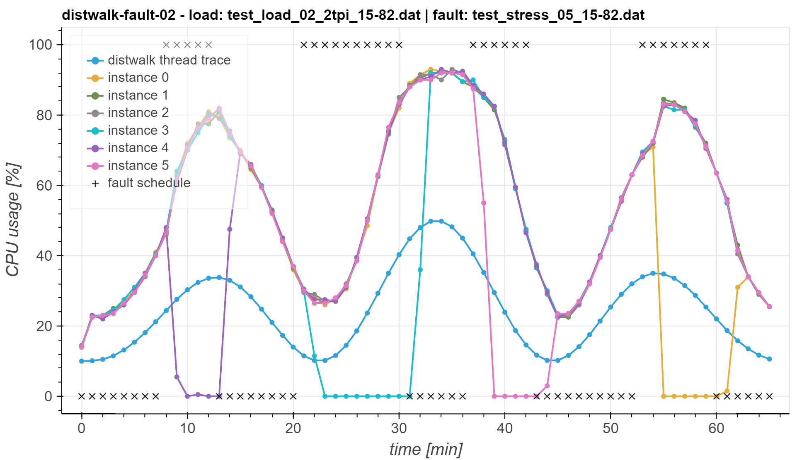
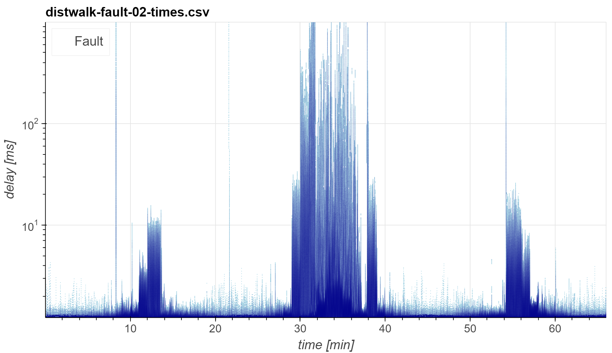

[](https://github.com/giacomolanciano/intelligent-cloud-operations/blob/master/LICENSE)
[](https://zenodo.org/badge/latestdoi/485707047)

# Intelligent Cloud Operations

This repo contains the companion material of the paper

**A 2-phase Strategy For Intelligent Cloud Operations**<br>
[Giacomo Lanciano](mailto:giacomo.lanciano@sns.it)\* Tommaso Cucinotta, Davide Bacciu, Andrea Passarella<br>
*Under review*<br>

*Abstract:* The health status of production-grade cloud applications is usually continuously assessed by monitoring
relevant KPIs, in order to meet the established Service Level Agreements (SLAs). Using (complex) automations, it is
possible to detect anomalous behaviors and alert the on-call personnel to start troubleshooting activities or, to a
certain extent, trigger automated healing procedures to prevent a system outage. Traditionally, such automations are
either based on static thresholds set on relevant metrics or on predefined pattern-matching rules to be checked against
logs. Defining and maintaining such rules quickly becomes cumbersome as soon as the size of an application grows and the
interactions among its components become more complex. To overcome such issues, we propose a strategy for intelligent
cloud operations that consists of two phases. First, we continuously monitor the system to detect anomalous operational
conditions. In that case, we identify the faulty components and the best corrective action to bring the back to normal.
Both phases rely on Machine Learning models learned directly from operational data and do not leverage on explicit
alerting or automation rule. Our approach was validated on data exported from an OpenStack deployment, collected while
generating a synthetic workload on a load-balanced group of VMs and injecting different types of faults. Our anomaly
detection model can generalize to elastic VMs groups and reached a validation AUC of 95% and a test accuracy of 88.80%.
Instead, the supervised classification model we trained to associate a corrective action to faulty VMs reached a test
accuracy of 99.34%. The implementation of our approach and the material needed to reproduce our results are publicly
made available under an open-source license.

\* *contact author*

## Requirements

In what follows, we provide instructions to install the required dependencies, assuming a setup that is similar to our
testing environment.

The test-bed used for our experiments is a Dell R630 dual-socket, equipped with: 2 Intel Xeon E5-2640 v4 CPUs (2.40 GHz,
20 virtual cores each); 64 GB of RAM; Ubuntu `20.04.2 LTS` operating system; version `5.17.0` of the Linux kernel.

### Data

[](https://doi.org/10.5281/zenodo.6509678)

The data used for this work are [publicly available](https://zenodo.org/record/6509678/files/INTOPS2022-data.tar.bz2).
We recommend using our utility to automatically download, decompress and place such data in the location expected by our
tools. To do that, make sure the required dependencies are installed by running

```bash
apt-get install pbzip2 tar wget
```

To start the download utility, run `make data` from the root of this repo. Once the download terminates, the following
files are placed under `data/`:

| File                                                 | Description                                                      |
| :--------------------------------------------------- | :--------------------------------------------------------------- |
| `amphora-x64-haproxy.qcow2`                          | Image used to create Octavia amphorae                            |
| `distwalk-{fault,stress}-<INCREMENTAL-ID>.csv`       | `distwalk` run data, used to train corrective actions classifier |
| `distwalk-{fault,stress}-<INCREMENTAL-ID>.log`       | `distwalk` run log                                               |
| `distwalk-{fault,stress}-<INCREMENTAL-ID>-real.json` | Metric data exported from Monasca DB                             |
| `distwalk-{fault,stress}-<INCREMENTAL-ID>-times.csv` | Client-side response time for each request sent during a run     |
| `model_dumps/*`                                      | Dumps of the models used for the validation                      |
| `train_super_steep_behavior.csv`                     | Dataset used to train the anomaly detection model                |
| `test_load_*.dat`                                    | `distwalk` load traces                                           |
| `test_stress_*.dat`                                  | Traces used to inject anomalies during `distwalk` runs           |
| `ubuntu-20.04-min-distwalk-4ca3b54.img`              | Image used to create Nova instances for the scaling group        |

### Python

Python `3.8.10` must be installed in order to install OpenStack (with Kolla) and run the Python code included in this
repo.

If needed, consider using a tool like [`pyenv`](https://github.com/pyenv/pyenv) to easily install and manage multiple
Python versions on the same system.

### OpenStack

OpenStack `victoria` version is required to run our predictive auto-scaling strategy. On top of the other core OpenStack
services, we leverage on the following:

- Heat
- Monasca
- Nova
- Octavia
- Senlin

Follow the [OpenStack documentation](https://docs.openstack.org/victoria/install/) to install the required services.

Alternatively, this repo includes (under `openstack/`) the config files we used to set up an all-in-one OpenStack
containerized deployment using [Kolla](https://docs.openstack.org/kolla/victoria/) (`victoria` version). Follow the
[`kolla-ansible` documentation](https://docs.openstack.org//kolla-ansible/victoria/doc-kolla-ansible.pdf) to decide on
how to fill the fields marked as `TO BE FILLED` in the such files. Then, assuming the following command to be issued
from the `openstack/` directory (unless otherwise specified), deploy OpenStack by applying these steps:

1. Install Kolla dependencies by running `./install-deps.sh`. [Docker](https://docs.docker.com/engine/install/ubuntu/)
   is also required and must be installed separately.

2. Build the required Kolla images by running `./kolla-build-images.sh`.

3. Start the deployment process by running `./kolla-start-all-nodes.sh`.

Once the deployment is up and running, assuming the following command to be issued from the root of this repo (unless
otherwise specified), complete the configuration by applying these steps:

1. Create an SSH key-pair to be used for accessing the instances in the scaling group:

   ```bash
   ssh-keygen -t rsa -b 4096
   ```

2. Initialize the current OpenStack project by deploying the resources defined in the `openstack/heat/init.yaml` Heat
   Orchestration Template (HOT):

   ```bash
   openstack stack create --enable-rollback --wait \
       --parameter admin_public_key="<PUBLIC-SSH-KEY-TEXT>" \
       -t openstack/heat/init.yaml init
   ```

   **NOTE:** the other parameters concerning networking configs are provided with default values that makes sense on our
   test-bed. Consider reviewing them before deploying.

3. Upload the image to be used for creating the instances in the scaling group:

   ```bash
   openstack image create \
       --container-format bare \
       --disk-format qcow2 \
       --file data/ubuntu-20.04-min-distwalk-4ca3b54.img \
       --public \
       ubuntu-20.04-min-distwalk-4ca3b54
   ```

4. As it is the case for our test-bed, Octavia may get stuck at creating amphorae due to the provider network subnet
   being different from the host network. When experiencing similar issues, try and apply our workaround by running
   `./octavia-setup.sh` from the `openstack/` directory.

### distwalk

We use [`distwalk`](https://github.com/tomcucinotta/distwalk) to generate traffic on the scaling group. To install the
specific version used for our experiments (i.e., commit `4ca3b54`), run

```bash
git clone https://github.com/tomcucinotta/distwalk
cd distwalk
git checkout 4ca3b54
make
```

The binaries for the client and server modules (`client` and `node`, respectively) will be generated under
`distwalk/src/`.

### stress-ng

We use [`stress-ng`](https://github.com/ColinIanKing/stress-ng) to generate external load that interfere with the VMs in
the scaling group. To install the specific version used for our experiments (i.e., commit `bbeded35`), run

```bash
git clone https://github.com/ColinIanKing/stress-ng
cd stress-ng
git checkout bbeded35
make
```

### Jupyter

This repo includes Jupyter notebooks. To install JupyterLab, assuming that `pip3` is the version of `pip` associated
with Python `3.8.10`, run

```bash
pip3 install -U pip
pip3 install jupyterlab==3.1.12 jupytext==1.11.2
```

Notice that we leverage on `jupytext` such that each notebook is paired (and automatically kept synchronized) with an
equivalent Python script, that is what is actually versioned in this repo. To configure `jupytext` accordingly, append
the following lines to your Jupyter configs (e.g., `~/.jupyter/jupyter_notebook_config.py`):

```python
c.ContentsManager.allow_hidden = True
c.ContentsManager.comment_magics = True
c.ContentsManager.default_jupytext_formats = "ipynb,py:percent"
c.NotebookApp.contents_manager_class = "jupytext.TextFileContentsManager"
```

**NOTE:** To open a paired Python script as a notebook from JupyterLab, right-click on the script and then click on
"Open With" > "Notebook".

## Running the notebooks

The notebooks included in this repo can be used to visualize the results of the runs, as well as to train the
time-series forecasting models used in this work. Here is a summary of what can be found under `notebooks/`:

| File                   | Description                                                                                                  |
| :--------------------- | :----------------------------------------------------------------------------------------------------------- |
| `constants.py`         | Module containing constant values (e.g., metadata about the performed runs)                                  |
| `results_load.py`      | Notebook that plots the time-series exported from Monasca DB                                                 |
| `results_times.py`     | Notebook that plots `distwalk` client-side response times and produces a table regarding their distributions |
| `train_actions_clf.py` | Notebook that allows for training the corrective actions classifier                                          |
| `train_ad.py`          | Notebook that allows for training the anomaly detection model                                                |

To run the notebooks, it is necessary to set up a virtual env to be used as a kernel, by running `make py38` from the
root of this repo. Once the command terminates, a new kernel named `pred-ops-os` will be available for the current user.
The notebooks are set to use this kernel by default.

Example of output generated by `results_load.py`:



Example of output generated by `results_times.py`:



## Launching a new run

We assume all the following commands to be issued from the root of this repo (unless otherwise specified). Here are the
steps to apply to launch a new run:

0. Make sure the current user is provided with credentials granting full-access to an OpenStack project that was
   initialized according to the [provided instructions](#openstack).

1. Deploy the required OpenStack resources using the `openstack/heat/senlin-auto-scaling.yaml` HOT. Run:

   ```bash
   openstack stack create --enable-rollback --wait \
      --parameter auto_scaling_enabled=false \
      --parameter health_policy_enabled=false \
      --parameter lb_policy_method=LEAST_CONNECTIONS \
      --parameter instance_delay=0 \
      --parameter instance_cpu_policy=dedicated \
      --parameter cluster_desired_size=<DESIRED_SIZE> \
      -t openstack/heat/senlin-auto-scaling.yaml senlin
   ```

   **NOTE:** substitute `<DESIRED_SIZE>` with the number of VMs that should be deployed into the scaling group. In our
   runs, we used either 3 or 6. It is possible to send requests to the system as soon as the `operating_status`
   of the load-balancer turns to `ONLINE`. Such condition can be checked with the following command:

   ```bash
   $ openstack loadbalancer status show <OCTAVIA-LB-ID>
   {
      "loadbalancer": {
         "id": "<OCTAVIA-LB-ID>",
         "name": "<OCTAVIA-LB-NAME>",
         "operating_status": "ONLINE",
         "provisioning_status": "ACTIVE",
   [...]
   ```

2. Copy `config.conf.template` to `config.conf` and fill in the fields marked as `TO BE FILLED`.

   **NOTE:** in our experiments, we set `num_threads` such that we had 2 `distwalk` client threads per VM (i.e., to
   either 6 or 12). Also, when injecting anomalies with `stress.sh` (see below), make sure to set `injection_cpu_aff`
   such that it matches the physical CPU cores where the VMs are scheduled (that should remain the same for the entire
   life of a VM, provided that they were deployed according to our configurations).

3. Open two terminal windows to launch `distwalk` and our anomaly injection scripts separately.

   **NOTE:** we expect the user to launch the two processes (as explained in the following steps) in rapid succession.
   However, our `distwalk` load trace is designed such that we can tolerate a few seconds delay, without affecting the
   interesting parts of the results of a run.

4. To launch `distwalk`, use `run.sh` specifying a log file named according to the following convention, depending on
   the chosen anomaly type:

   ```bash
   ./run.sh --log data/distwalk-{fault,stress}-<INCREMENTAL-ID>.log
   ```

   The other output files will be created under `data/` and named accordingly. Such naming convention is the one
   expected by the provided Jupyter notebooks to automatically plot the results of the new run. Depending on the
   specified `distwalk` load trace, this process might take a long time to terminate.

5. To inject anomalies while `distwalk` is running, launch `stress.sh` to generate interferences on the same physical
   CPU cores where the VMs are scheduled, or `fault.sh` to temporary kill a `distwalk` server process running within a
   VM.

6. To load the results of the new run in the notebooks, add an entry to `notebooks/constants.py`, depending on the
   injected anomaly type, using the following structure:

   ```json
   ### TO BE FILLED (use the same ID of distwalk log) ###
   <INCREMENTAL-ID>: {
        ### TO BE FILLED (the name of the distwalk trace file) ###
        "load_profile": ...,

        ### TO BE FILLED (see tail of distwalk log) ###
        "start_real": ...,

        ### TO BE FILLED (see tail of distwalk log) ###
        "end_real": ...,

        ### TO BE FILLED (the name of the injection trace file, depending on the anomaly type) ###
        "stress": ...,
        ### or ###
        "fault": ...,
   },
   ```

   **NOTE:** After editing `notebooks/constants.py`, it may be necessary to restart the notebook kernels to fetch the
   update.

<!-- ## Citation

Please consider citing:

```bibtex

``` -->
